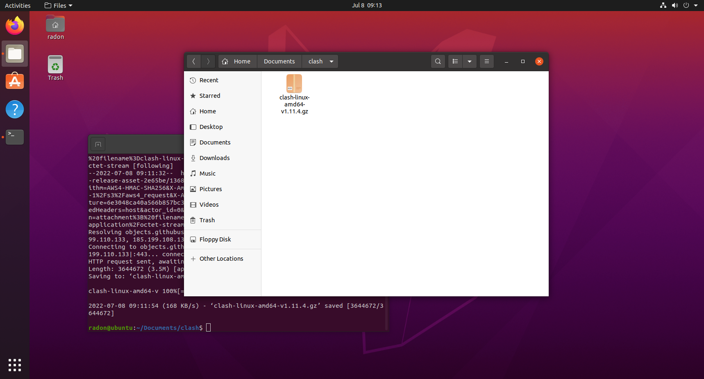
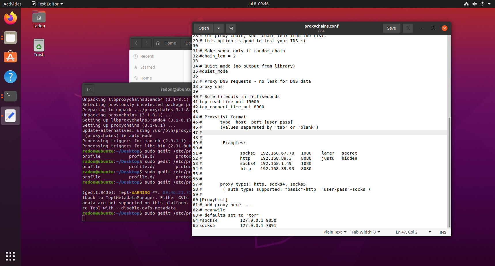

# Porxy tutorial

## 浏览器代理设置
首先，下载clash
可以从[https://github.com/Dreamacro/clash/releases](https://github.com/Dreamacro/clash/releases)选择clash-linux-amd64-vXXX来下载，或者使用以下指令：
```
wget https://github.com/Dreamacro/clash/releases/download/v1.11.4/clash-linux-amd64-v1.11.4.gz
```
由于国内网络原因，可能需要多下载几次


第二步，下载相应的配置文件，如config.yaml之类的。如果用clash自动生成的config.yaml的话，需要更改文件中的各种设置才能使用代理。<font color=red>如果是下载的配置文件，记得将config.yml改名成config.yaml</font>


第三步，解压clash的文件夹，得到运行程序

```
gzip -d ./clash-linux-amd64-v1.11.4.gz
mv clash-linux-amd64-v1.11.4 clash
```


第四步，运行`./clash -d .`，如果提示缺少权限的话就运行`chmod +x ./clash`


再次运行`./clash -d .`，如果提示Country.mmdb无法下载的话，可以运行以下指令来下载，记得要把mmdb和clash程序放在同一个文件夹下：
```
wget https://github.com/Radon10043/clash_necessary/raw/main/Country.mmdb
```
访问[http://clash.razord.top/](http://clash.razord.top/)可以进行测速等操作。
最后，试试是否成功了吧，先启动clash：
```
./clash -d .
```
在ubuntu的settings->Network中改一下proxy，根据需要更改各端口值。


打开浏览器，要是能通过代理访问网站的话，就表示配置成功了！

## 终端代理设置
虽然浏览器可以通过代理上网了，但是终端还是不行的，这时候就要使用proxychains了。
打开终端，输入以下指令进行安装
```
sudo apt install proxychains
```
安装完毕后，需要配置一下才行，打开proxychains的配置文件进行配置：
```
sudo gedit /etc/proxychains.conf
```
把最后一行的socks4注释掉，改成socks5和相应的端口号后再保存，就可以了。之后，如果有些指令需要通过代理的话，在指令前加个proxychains就可以了:)
```
proxychains XXX
```
